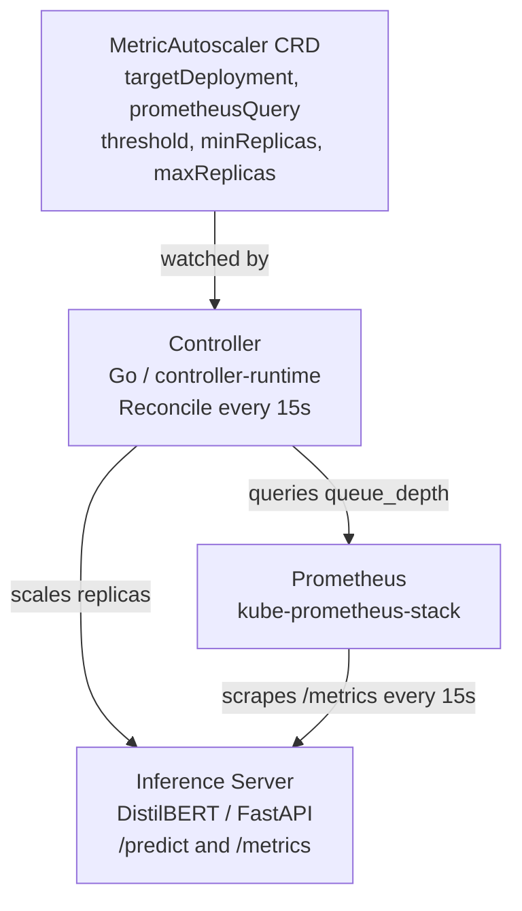

# AI Inference Kubernetes MetricAutoscaler

A production-style Kubernetes operator that automatically scales AI inference server replicas based on real-time request queue depth metrics from Prometheus. Built with Go, kubebuilder, and controller-runtime — deployed on a self-managed 3-node k3s cluster.

## What It Does

This project implements a custom Kubernetes controller that:

1. Watches a custom resource (`MetricAutoscaler`) defining a target deployment, a PromQL query, a scaling threshold, and replica bounds
2. Continuously queries Prometheus for the current metric value (e.g. inference request queue depth)
3. Scales the target deployment up or down based on whether the metric exceeds the threshold
4. Runs the reconcile loop every 15 seconds, automatically correcting any drift between desired and actual state

The result: when inference request load spikes, replicas scale up automatically. When load drops, replicas scale back down — no human intervention required.

## Architecture



## Stack

- **Go** — controller implementation
- **kubebuilder + controller-runtime** — operator scaffold and reconcile framework
- **k3s** — lightweight Kubernetes distribution, self-managed on 3 Multipass VMs
- **Prometheus + Grafana** — metrics collection via kube-prometheus-stack Helm chart
- **DistilBERT** (HuggingFace Transformers) — real inference workload served via FastAPI
- **Docker** — multi-stage image builds for both the controller and inference server

## Custom Resource

```yaml
apiVersion: apps.yourdomain.dev/v1
kind: MetricAutoscaler
metadata:
  name: queue-autoscaler
  namespace: default
spec:
  tipass (for local k3s VMs)
- kubectl
- Helm
- Go 1.26+

### 1. Spin up a 3-node k3s cluster

```bash
multipass launch --name k3s-node1 --cpus 2 --memory 4G --disk 20G
multipass shell k3s-node1
curl -sfL https://get.k3s.io | sh -
sudo cat /var/lib/rancher/k3s/server/node-token
# use token to join node2 and node3 as workers
```

### 2. Install Prometheus

```bash
helm repo add prometheus-community https://prometheus-community.github.io/helm-charts
helm repo update
kubectl apply -f kube-prometheus-stack/charts/crds/crds/ --server-side --force-conflicts
helm install prometheus prometheus-community/kube-prometheus-stack \
  --namespace monitoring --create-namespace --skip-crds
```

### 3. Install the CRD and deploy the controller

```bash
make install
kubectl apply -f config/manager/manager.yaml
kubectl apply -f config/rbac/
```

### 4. Deploy the inference server

```bash
docker build --platform linux/arm64 -t inference-server:v2 -f cmd/inference-server/Dockerfile .
# transfer image to k3s nodes, then:
kubectl apply -f config/inference-server/
```

### 5. Apply the MetricAutoscaler resource

```bash
kubectl apply -f config/samples/apps_v1_metricautoscaler.yaml
```

### 6. Generate load and watch the controller scale

```bash
# port-forward the inference server
kubectl port-forward svc/inference-server 8080:8080

# fire concurrent inference requests
for i in {1..20}; do
  curl -s -X POST http://localhost:8080/predict \
    -H "Content-Type: application/json" \
    -d '{"text": "This is amazing"}' &
done
wait

# watch controller logs
kubectl logs -n system -l control-plane=controller-manager -f
```

## Key Design Decisions

- **`time.Time{}` for Prometheus queries** — passes no timestamp so Prometheus evaluates at server time, avoiding clock skew issues between client and server
- **Prometheus client created once at startup** — not recreated on every reconcile, avoiding connection pool exhaustion
- **`imagePullPolicy: Never`** — images are manually imported into k3s containerd rather than pulled from a registabling offline/local development
- **ServiceMonitor** — Prometheus scrape config managed declaratively via the Prometheus Operator CRD, not static config files

## Repository Structure
├── api/v1/                          # MetricAutoscaler CRD types

├── cmd/

│   ├── main.go                      # Controller entrypoint

│   └── inference-server/            # FastAPI DistilBERT inference server

├── config/

│   ├── crd/                         # Generated CRD manifests

│   ├── inference-server/            # Deployment, Service, ServiceMonitor

│   ├── manager/                     # Controller deployment manifest

│   ├── rbac/                        # RBAC roles and bindings

│   └── samples/                     # Example MetricAutoscaler resource

└── internal/controller/             # Reconcile() logic

## Author

[Nikhil Karthikeyan](https://github.com/nkarthik23)
